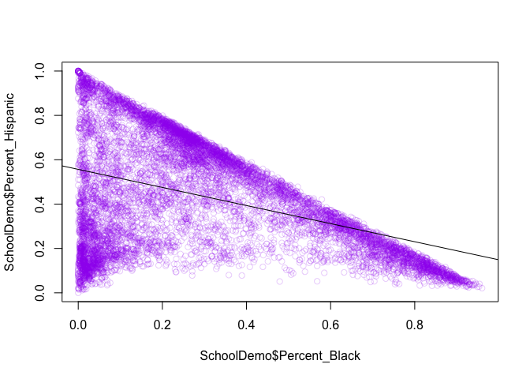

School Demographics v2
================
Elias Guerra
7/15/2022

## Blah blah blah

The beginning is my failed attempt at cleaning up the data. Behold in
awe (it sucks).

``` r
library(tidyverse)
(SchoolDemo <- read_csv("~/Documents/R/Datasets/2017-18__-_2021-22_Demographic_Snapshot.csv"))
```

    ## # A tibble: 9,251 x 44
    ##    DBN   `School Name` Year  `Total Enrollme… `Grade 3K` `Grade PK (Half…
    ##    <chr> <chr>         <chr>            <dbl>      <dbl>            <dbl>
    ##  1 01M0… P.S. 015 Rob… 2017…              190          0               17
    ##  2 01M0… P.S. 015 Rob… 2018…              174          0               13
    ##  3 01M0… P.S. 015 Rob… 2019…              190          0               14
    ##  4 01M0… P.S. 015 Rob… 2020…              193          0               17
    ##  5 01M0… P.S. 015 Rob… 2021…              179          0               15
    ##  6 01M0… P.S. 019 Ash… 2017…              257          0               13
    ##  7 01M0… P.S. 019 Ash… 2018…              249          0               10
    ##  8 01M0… P.S. 019 Ash… 2019…              236          0               16
    ##  9 01M0… P.S. 019 Ash… 2020…              212          0               13
    ## 10 01M0… P.S. 019 Ash… 2021…              176          9                7
    ## # … with 9,241 more rows, and 38 more variables: `Grade K` <dbl>, `Grade
    ## #   1` <dbl>, `Grade 2` <dbl>, `Grade 3` <dbl>, `Grade 4` <dbl>, `Grade
    ## #   5` <dbl>, `Grade 6` <dbl>, `Grade 7` <dbl>, `Grade 8` <dbl>, `Grade
    ## #   9` <dbl>, `Grade 10` <dbl>, `Grade 11` <dbl>, `Grade 12` <dbl>, `#
    ## #   Female` <dbl>, `% Female` <dbl>, `# Male` <dbl>, `% Male` <dbl>, `#
    ## #   Asian` <dbl>, `% Asian` <dbl>, `# Black` <dbl>, `% Black` <dbl>, `#
    ## #   Hispanic` <dbl>, `% Hispanic` <dbl>, `# Multi-Racial` <dbl>, `%
    ## #   Multi-Racial` <dbl>, `# Native American` <dbl>, `% Native
    ## #   American` <dbl>, `# White` <dbl>, `% White` <dbl>, `# Missing
    ## #   Race/Ethnicity Data` <dbl>, `% Missing Race/Ethnicity Data` <dbl>, `#
    ## #   Students with Disabilities` <dbl>, `% Students with
    ## #   Disabilities` <dbl>, `# English Language Learners` <dbl>, `% English
    ## #   Language Learners` <dbl>, `# Poverty` <chr>, `% Poverty` <chr>,
    ## #   `Economic Need Index` <chr>

``` r
fivenum(SchoolDemo$`% Asian`) # Range of % Asian students (min, first quartile, median, third qrt, max)
```

    ## [1] 0.000 0.014 0.042 0.145 0.943

``` r
SchoolDemo %>% filter(`% Hispanic` == 0 ) #Which school had 0 Hispanic students
```

    ## # A tibble: 1 x 44
    ##   DBN   `School Name` Year  `Total Enrollme… `Grade 3K` `Grade PK (Half…
    ##   <chr> <chr>         <chr>            <dbl>      <dbl>            <dbl>
    ## 1 84X6… Earl Monroe … 2021…              118          0                0
    ## # … with 38 more variables: `Grade K` <dbl>, `Grade 1` <dbl>, `Grade
    ## #   2` <dbl>, `Grade 3` <dbl>, `Grade 4` <dbl>, `Grade 5` <dbl>, `Grade
    ## #   6` <dbl>, `Grade 7` <dbl>, `Grade 8` <dbl>, `Grade 9` <dbl>, `Grade
    ## #   10` <dbl>, `Grade 11` <dbl>, `Grade 12` <dbl>, `# Female` <dbl>, `%
    ## #   Female` <dbl>, `# Male` <dbl>, `% Male` <dbl>, `# Asian` <dbl>, `%
    ## #   Asian` <dbl>, `# Black` <dbl>, `% Black` <dbl>, `# Hispanic` <dbl>, `%
    ## #   Hispanic` <dbl>, `# Multi-Racial` <dbl>, `% Multi-Racial` <dbl>, `#
    ## #   Native American` <dbl>, `% Native American` <dbl>, `# White` <dbl>, `%
    ## #   White` <dbl>, `# Missing Race/Ethnicity Data` <dbl>, `% Missing
    ## #   Race/Ethnicity Data` <dbl>, `# Students with Disabilities` <dbl>, `%
    ## #   Students with Disabilities` <dbl>, `# English Language
    ## #   Learners` <dbl>, `% English Language Learners` <dbl>, `#
    ## #   Poverty` <chr>, `% Poverty` <chr>, `Economic Need Index` <chr>

``` r
# Also this ^ is how you use "pipes" in dplyr library to make things nice to look at.

Demo1 <- select(SchoolDemo, #Cleaning SchoolDemo
                     School = "School Name",
                     Enroll = 'Total Enrollment',
                     Black = '% Black', 
                     Hisp = '% Hispanic',
                     Asian = '% Asian',
                     White = '% White',
                     Poverty = '% Poverty')
Demo1$Year <- substr(SchoolDemo$Year, 1, 4) #fix "year" to remove range (eg. 2017-18 --> 2017)
# Demo1$change2018 <- filter(Demo1, year == 2018) - filter(Demo1, year == 2017)
  # We can't compare 2017 and 2018 here because the columns are not the same length.
  # Not every school has data for 2017 and 2018
  # But we need this to calculate percent change for each year
  # Time to remove school for which we have incomplete data
  school_names <- unique(Demo1$School)
  x <- Demo1[Demo1$School == school_names[1],] 
  #(x <- filter(Demo1, School == school_names[1])) #same thing
  x$all5yrs <- nrow(x) == 5 #wrosk
  
  All5yrs <- vector()
  Schoolx <- vector()
for (i in school_names) {
  # i <- school_names[1]
  x <- Demo1 %>% filter(School == i) # filter by school
  t <- nrow(x) == 5 #which have 5 rows
  Schoolx <- c(Schoolx, i)
  All5yrs <- c(All5yrs, t)
}
  #check it works
  All5yrs_df <- data.frame(school = Schoolx,
                      allyrs = All5yrs) %>% tibble()
  length(unique(Demo1$School)) == nrow(All5yrs_df)
```

    ## [1] TRUE

``` r
  # I dont know why I did all this:(
  
  # Blah blah blah
  #starting over
  rm(list = ls())
```

I’m using the tidyverse library because it’s really useful for producing
really clean graphs and super easy-to-use langauge for cleaning and
massaging data.

## Where the work really starts

Doing the same kind of thing but a little neater. I still realized after
I created this for loop to compare percent poverty to the previous year
(see below) that it was redundant (but now you know I can make for loops
and things more complicated than they need to be). See my cool graphs at
the end.

``` r
# STARTING F ROM SCRATCH
  #Clean SchoolDemo
library(tidyverse)
(SchoolDemo <- read_csv("~/Documents/R/Datasets/2017-18__-_2021-22_Demographic_Snapshot.csv"))
```

    ## Parsed with column specification:
    ## cols(
    ##   .default = col_double(),
    ##   DBN = col_character(),
    ##   `School Name` = col_character(),
    ##   Year = col_character(),
    ##   `# Poverty` = col_character(),
    ##   `% Poverty` = col_character(),
    ##   `Economic Need Index` = col_character()
    ## )

    ## See spec(...) for full column specifications.

    ## # A tibble: 9,251 x 44
    ##    DBN   `School Name` Year  `Total Enrollme… `Grade 3K` `Grade PK (Half…
    ##    <chr> <chr>         <chr>            <dbl>      <dbl>            <dbl>
    ##  1 01M0… P.S. 015 Rob… 2017…              190          0               17
    ##  2 01M0… P.S. 015 Rob… 2018…              174          0               13
    ##  3 01M0… P.S. 015 Rob… 2019…              190          0               14
    ##  4 01M0… P.S. 015 Rob… 2020…              193          0               17
    ##  5 01M0… P.S. 015 Rob… 2021…              179          0               15
    ##  6 01M0… P.S. 019 Ash… 2017…              257          0               13
    ##  7 01M0… P.S. 019 Ash… 2018…              249          0               10
    ##  8 01M0… P.S. 019 Ash… 2019…              236          0               16
    ##  9 01M0… P.S. 019 Ash… 2020…              212          0               13
    ## 10 01M0… P.S. 019 Ash… 2021…              176          9                7
    ## # … with 9,241 more rows, and 38 more variables: `Grade K` <dbl>, `Grade
    ## #   1` <dbl>, `Grade 2` <dbl>, `Grade 3` <dbl>, `Grade 4` <dbl>, `Grade
    ## #   5` <dbl>, `Grade 6` <dbl>, `Grade 7` <dbl>, `Grade 8` <dbl>, `Grade
    ## #   9` <dbl>, `Grade 10` <dbl>, `Grade 11` <dbl>, `Grade 12` <dbl>, `#
    ## #   Female` <dbl>, `% Female` <dbl>, `# Male` <dbl>, `% Male` <dbl>, `#
    ## #   Asian` <dbl>, `% Asian` <dbl>, `# Black` <dbl>, `% Black` <dbl>, `#
    ## #   Hispanic` <dbl>, `% Hispanic` <dbl>, `# Multi-Racial` <dbl>, `%
    ## #   Multi-Racial` <dbl>, `# Native American` <dbl>, `% Native
    ## #   American` <dbl>, `# White` <dbl>, `% White` <dbl>, `# Missing
    ## #   Race/Ethnicity Data` <dbl>, `% Missing Race/Ethnicity Data` <dbl>, `#
    ## #   Students with Disabilities` <dbl>, `% Students with
    ## #   Disabilities` <dbl>, `# English Language Learners` <dbl>, `% English
    ## #   Language Learners` <dbl>, `# Poverty` <chr>, `% Poverty` <chr>,
    ## #   `Economic Need Index` <chr>

``` r
colnames(SchoolDemo) 
```

    ##  [1] "DBN"                            "School Name"                   
    ##  [3] "Year"                           "Total Enrollment"              
    ##  [5] "Grade 3K"                       "Grade PK (Half Day & Full Day)"
    ##  [7] "Grade K"                        "Grade 1"                       
    ##  [9] "Grade 2"                        "Grade 3"                       
    ## [11] "Grade 4"                        "Grade 5"                       
    ## [13] "Grade 6"                        "Grade 7"                       
    ## [15] "Grade 8"                        "Grade 9"                       
    ## [17] "Grade 10"                       "Grade 11"                      
    ## [19] "Grade 12"                       "# Female"                      
    ## [21] "% Female"                       "# Male"                        
    ## [23] "% Male"                         "# Asian"                       
    ## [25] "% Asian"                        "# Black"                       
    ## [27] "% Black"                        "# Hispanic"                    
    ## [29] "% Hispanic"                     "# Multi-Racial"                
    ## [31] "% Multi-Racial"                 "# Native American"             
    ## [33] "% Native American"              "# White"                       
    ## [35] "% White"                        "# Missing Race/Ethnicity Data" 
    ## [37] "% Missing Race/Ethnicity Data"  "# Students with Disabilities"  
    ## [39] "% Students with Disabilities"   "# English Language Learners"   
    ## [41] "% English Language Learners"    "# Poverty"                     
    ## [43] "% Poverty"                      "Economic Need Index"

``` r
SchoolDemo$Year  <- substr(SchoolDemo$Year, 1, 4)


#new cleaner supremer School Demographics
newSchoolDemo <- select(SchoolDemo, 
                        School = `School Name`, 
                        Year = Year,
                        Enrollment = `Total Enrollment`,
                        Black = `% Black`,
                        Asian = `% Asian`,
                        White = `% White`,
                        Hispanic = `% Hispanic`,
                        Poverty = `% Poverty`)
newSchoolDemo$Poverty <- parse_number(newSchoolDemo$Poverty)/100


#@)#$*(%#)$@(%*@$#%*@$#(%!(*@#%&)))*************
# START run from here 
school_names <- unique(SchoolDemo$`School Name`)
Poverty_Change <- vector()  # should be == school names x years (for each school)
Poverty_df <- vector(length = 3)
Howmanyyears <- vector() #How many years of data 

### FOR Go by each school and count changes in percent poverty over each year
for (i in school_names) { # Filter by school
      # i <- school_names[1] # EXAMPLE
      # print(i) # TESTING
  x <- filter(newSchoolDemo, School == i)
  years <- as.numeric(x$Year) #years available (1-5)
  Howmanyyears <- c(Howmanyyears, length(years))
  
    for (y in years) { # Compare this year and previous
          # y <- 2018 #  EXAMPLE
          # print(y) #TESTING
      poverty_yr <- x$Poverty[x$Year == y]
      poverty_yr_prev <- x$Poverty[x$Year == (y-1)]
      if (is_empty(poverty_yr_prev) == TRUE) {poverty_yr_prev <- NA} #if prev year empty then NA
      z <- poverty_yr - poverty_yr_prev # Difference in poverty (or NA)

      #Organize outputs
      Poverty_Change <- c(Poverty_Change, z)
      Poverty_df <- rbind(Poverty_df, 
                          c(i, y, z)) # school name, year, change in % poverty
    }
}

# Clean Povety_df (change in percent poverty for each school for every year) 
# and combine with newSchoolDemo
Poverty_df <- as_tibble(Poverty_df)
Poverty_df<- Poverty_df[-1,] 
colnames(Poverty_df) <- c("School", "Year", "Change_perc_poverty")
newSchoolDemo <- left_join(newSchoolDemo, Poverty_df, by = c("School", "Year"))

# Count duplicates (how many years data at each school)
Duplicates_df <- tibble(
  School = unique(newSchoolDemo$School),
  Duplicates = newSchoolDemo$School %>% as_factor() %>% tabulate() 
)
newSchoolDemo <- left_join(newSchoolDemo, Duplicates_df, by = "School")

# DATA IS CLEAN NOW!!
#analyzzzze

#First look: Enrollment
ggplot(newSchoolDemo, aes(x = Year, y = Enrollment, group = School)) +
  geom_point(alpha = .05)
```

<!-- -->

``` r
# Zoomed in and connecting each school over years
# ENROLLMENT
ggplot(newSchoolDemo, aes(x = Year, y = Enrollment, group = School)) +
  geom_point(alpha = .01) +
  geom_line(alpha = .01, size= 1.1) +
  ylim(0, 1500)
```

<!-- -->

``` r
  # Not much going on here


# POVERTY
#First look
ggplot(newSchoolDemo, aes(x = Year, y = Poverty, group = School)) +
  geom_point(alpha = .05)
```

<!-- -->

``` r
#Zoomed in
# Made the lines darker and skinnier
ggplot(newSchoolDemo, aes(x = Year, y = Poverty, group = School)) +
  geom_line(alpha = .1, size= .2) +
  ylim(.5,.95)
```

<!-- -->

``` r
  # Poverty is very high and does not seem to increase or change much
  ggplot(newSchoolDemo, aes(x = Year, y = Poverty, group = School)) +
  geom_line(alpha = .2, size= .2) +
  ylim(.8,.95) #same
```

<!-- -->

``` r
#CHANGE IN POVERTY
  ggplot(newSchoolDemo, aes(x = Year, y = Change_perc_poverty, group = School)) +
    geom_line(alpha = .2, size= .2) # idk tf
```

<!-- -->

``` r
  #RACE yeehaw


# HOW TO USE TAPPLY
data("iris")
head(iris)
```

    ##   Sepal.Length Sepal.Width Petal.Length Petal.Width Species
    ## 1          5.1         3.5          1.4         0.2  setosa
    ## 2          4.9         3.0          1.4         0.2  setosa
    ## 3          4.7         3.2          1.3         0.2  setosa
    ## 4          4.6         3.1          1.5         0.2  setosa
    ## 5          5.0         3.6          1.4         0.2  setosa
    ## 6          5.4         3.9          1.7         0.4  setosa

``` r
tapply(iris$Sepal.Width, iris$Species, median)
```

    ##     setosa versicolor  virginica 
    ##        3.4        2.8        3.0

``` r
# Average of Black students
tapply(newSchoolDemo$Black, newSchoolDemo$School, median) %>% head
```

    ## 47 The American Sign Language and English Secondar 
    ##                                              0.250 
    ##                                 A-Tech High School 
    ##                                              0.441 
    ##              A. Philip Randolph Campus High School 
    ##                                              0.288 
    ## A.C.E. Academy for Scholars at the Geraldine Ferra 
    ##                                              0.024 
    ##                        Abraham Lincoln High School 
    ##                                              0.410 
    ##                 Academic Leadership Charter School 
    ##                                              0.457

``` r
  newSchoolDemo$Black[newSchoolDemo$School == "A-Tech High School"] %>% median() #check
```

    ## [1] 0.441

``` r
# FOR CAPTURE AVERAGE % RACE FOR EACH YEAR
Average_per_race <- vector(length = 5)
for (i in c("Black", "White", "Asian", "Hispanic")) {
  d <- tapply( as_vector(newSchoolDemo[,i]), newSchoolDemo$Year, median)
  new_row <- c(race = i, d)
  Average_per_race <- rbind(Average_per_race, new_row)
}
Average_per_race <- Average_per_race[-1,] 
Average_per_race <- as_tibble(Average_per_race)
# Buuuutt we want years as their own column
# and all races combined into one column for pretty graphs
Average_per_race <- pivot_longer(Average_per_race, cols = 2:6, names_to = "year", values_to = "avg") #sexy
Average_per_race$avg <- as.numeric(Average_per_race$avg)
# PLOT
ggplot(Average_per_race, aes(x = year, y = avg, group = race, color = race)) +
  geom_line() 
```

<!-- -->

``` r
ggplot() + 
  geom_line(data = newSchoolDemo, aes(x = Year, y = White, group = School), alpha = .1, size= .2) +
  geom_line(data = newSchoolDemo, aes(x = Year, y = Asian, group = School), alpha = .1, size= .2) +
  geom_line(data = newSchoolDemo, aes(x = Year, y = Black, group = School), alpha = .1, size= .2) +
  geom_line(data = newSchoolDemo, aes(x = Year, y = Hispanic, group = School), alpha = .1, size= .2) +
  geom_line(data = Average_per_race, aes(x = year, y = avg, group = race, color = race)) + 
  ylim(0,1)
```

<!-- -->

``` r
# Wow we can see each school and the averages (Median remember) for each race super imposed.

# Divided by color? 
ggplot() + 
  geom_line(data = newSchoolDemo, aes(x = Year, y = White, group = School), alpha = .05, size= .2, color = "Purple") +
  geom_line(data = newSchoolDemo, aes(x = Year, y = Asian, group = School), alpha = .05, size= .2, color = "Red") + 
  geom_line(data = newSchoolDemo, aes(x = Year, y = Black, group = School), alpha = .05, size= .2, color = "Green") +
  geom_line(data = newSchoolDemo, aes(x = Year, y = Hispanic, group = School), alpha = .05, size= .2, color = "Blue") 
```

<!-- -->

``` r
#Not super useful

# https://open.spotify.com/track/2M4gBVSuTLI1GIcM9vL6DH?si=f85a0dff3c304d7b
# This is my fav
  # BLACK
  bd <- ggplot(newSchoolDemo, aes(x = Year, y = Black, group = School)) +
    geom_line(alpha = .1, size= .2) +
    ylim(0,1)# wow super low :(
  # ASIAN
  ad <- ggplot(newSchoolDemo, aes(x = Year, y = Asian, group = School)) +
    geom_line(alpha = .1, size= .2) +
    ylim(0,1)
  #HISPANIC
  hd <- ggplot(newSchoolDemo, aes(x = Year, y = Hispanic, group = School)) +
    geom_line(alpha = .1, size= .2) +
    ylim(0,1)
  # WHITE
  wd <- ggplot(newSchoolDemo, aes(x = Year, y = White, group = School)) +
    geom_line(alpha = .1, size= .2) +
    ylim(0,1)
  
#install.packages("patchwork")
library(patchwork)
# GRAPHING ALL RACES
bd + ad + hd + wd
```

<!-- -->

From this last set of graphs you can see the distribution over 4 years
of different ethnicities. Each line represent one school, so each graphs
shows all the school at once. It looks like the majority of schools have
no White or Asian students and lots of schools have not black students.
Hispanic students seem to never be absent in all schools but there is
lots of variation.

My opinion on the matter:
<https://ny.chalkbeat.org/2021/10/15/22728581/nyc-school-segregation-integratenyc-lawsuit-gifted>
<https://www.reuters.com/article/us-new-york-schools-racism/new-york-city-school-segregation-perpetuates-racism-lawsuit-contends-idUSKBN2B11WI>

## REGRESSION ANALYSIS

Behold, math. Let’s take a look at the effect that COVID had on
different age groups and see if there’s any statistic differences. Also
I want to see how often do Black, White and Asian students overlap in
the schools they’re at (our last analysis showed Hispanic students are
present in most schools).

``` r
SchoolDemo
```

    ## # A tibble: 9,251 x 44
    ##    DBN   `School Name` Year  `Total Enrollme… `Grade 3K` `Grade PK (Half…
    ##    <chr> <chr>         <chr>            <dbl>      <dbl>            <dbl>
    ##  1 01M0… P.S. 015 Rob… 2017               190          0               17
    ##  2 01M0… P.S. 015 Rob… 2018               174          0               13
    ##  3 01M0… P.S. 015 Rob… 2019               190          0               14
    ##  4 01M0… P.S. 015 Rob… 2020               193          0               17
    ##  5 01M0… P.S. 015 Rob… 2021               179          0               15
    ##  6 01M0… P.S. 019 Ash… 2017               257          0               13
    ##  7 01M0… P.S. 019 Ash… 2018               249          0               10
    ##  8 01M0… P.S. 019 Ash… 2019               236          0               16
    ##  9 01M0… P.S. 019 Ash… 2020               212          0               13
    ## 10 01M0… P.S. 019 Ash… 2021               176          9                7
    ## # … with 9,241 more rows, and 38 more variables: `Grade K` <dbl>, `Grade
    ## #   1` <dbl>, `Grade 2` <dbl>, `Grade 3` <dbl>, `Grade 4` <dbl>, `Grade
    ## #   5` <dbl>, `Grade 6` <dbl>, `Grade 7` <dbl>, `Grade 8` <dbl>, `Grade
    ## #   9` <dbl>, `Grade 10` <dbl>, `Grade 11` <dbl>, `Grade 12` <dbl>, `#
    ## #   Female` <dbl>, `% Female` <dbl>, `# Male` <dbl>, `% Male` <dbl>, `#
    ## #   Asian` <dbl>, `% Asian` <dbl>, `# Black` <dbl>, `% Black` <dbl>, `#
    ## #   Hispanic` <dbl>, `% Hispanic` <dbl>, `# Multi-Racial` <dbl>, `%
    ## #   Multi-Racial` <dbl>, `# Native American` <dbl>, `% Native
    ## #   American` <dbl>, `# White` <dbl>, `% White` <dbl>, `# Missing
    ## #   Race/Ethnicity Data` <dbl>, `% Missing Race/Ethnicity Data` <dbl>, `#
    ## #   Students with Disabilities` <dbl>, `% Students with
    ## #   Disabilities` <dbl>, `# English Language Learners` <dbl>, `% English
    ## #   Language Learners` <dbl>, `# Poverty` <chr>, `% Poverty` <chr>,
    ## #   `Economic Need Index` <chr>

``` r
colnames(SchoolDemo) <- colnames(SchoolDemo) %>% 
  str_replace("%", "Percent") %>% 
  str_replace("#", "Numbr") %>% 
  str_replace_all(" ", "_")
SchoolDemo$Percent_Poverty <- parse_number(SchoolDemo$Percent_Poverty)/100
colnames(SchoolDemo)
```

    ##  [1] "DBN"                                
    ##  [2] "School_Name"                        
    ##  [3] "Year"                               
    ##  [4] "Total_Enrollment"                   
    ##  [5] "Grade_3K"                           
    ##  [6] "Grade_PK_(Half_Day_&_Full_Day)"     
    ##  [7] "Grade_K"                            
    ##  [8] "Grade_1"                            
    ##  [9] "Grade_2"                            
    ## [10] "Grade_3"                            
    ## [11] "Grade_4"                            
    ## [12] "Grade_5"                            
    ## [13] "Grade_6"                            
    ## [14] "Grade_7"                            
    ## [15] "Grade_8"                            
    ## [16] "Grade_9"                            
    ## [17] "Grade_10"                           
    ## [18] "Grade_11"                           
    ## [19] "Grade_12"                           
    ## [20] "Numbr_Female"                       
    ## [21] "Percent_Female"                     
    ## [22] "Numbr_Male"                         
    ## [23] "Percent_Male"                       
    ## [24] "Numbr_Asian"                        
    ## [25] "Percent_Asian"                      
    ## [26] "Numbr_Black"                        
    ## [27] "Percent_Black"                      
    ## [28] "Numbr_Hispanic"                     
    ## [29] "Percent_Hispanic"                   
    ## [30] "Numbr_Multi-Racial"                 
    ## [31] "Percent_Multi-Racial"               
    ## [32] "Numbr_Native_American"              
    ## [33] "Percent_Native_American"            
    ## [34] "Numbr_White"                        
    ## [35] "Percent_White"                      
    ## [36] "Numbr_Missing_Race/Ethnicity_Data"  
    ## [37] "Percent_Missing_Race/Ethnicity_Data"
    ## [38] "Numbr_Students_with_Disabilities"   
    ## [39] "Percent_Students_with_Disabilities" 
    ## [40] "Numbr_English_Language_Learners"    
    ## [41] "Percent_English_Language_Learners"  
    ## [42] "Numbr_Poverty"                      
    ## [43] "Percent_Poverty"                    
    ## [44] "Economic_Need_Index"

``` r
# Pre-k vs enrollment
lm_gk <- lm(Total_Enrollment ~ Grade_K, data = SchoolDemo)
summary(lm_gk)
```

    ## 
    ## Call:
    ## lm(formula = Total_Enrollment ~ Grade_K, data = SchoolDemo)
    ## 
    ## Residuals:
    ##    Min     1Q Median     3Q    Max 
    ## -605.8 -230.0  -99.7   61.2 5550.6 
    ## 
    ## Coefficients:
    ##             Estimate Std. Error t value Pr(>|t|)    
    ## (Intercept) 489.3543     6.3040   77.63   <2e-16 ***
    ## Grade_K       2.0213     0.1003   20.16   <2e-16 ***
    ## ---
    ## Signif. codes:  0 '***' 0.001 '**' 0.01 '*' 0.05 '.' 0.1 ' ' 1
    ## 
    ## Residual standard error: 459.9 on 9249 degrees of freedom
    ## Multiple R-squared:  0.0421, Adjusted R-squared:  0.042 
    ## F-statistic: 406.5 on 1 and 9249 DF,  p-value: < 2.2e-16

``` r
plot(SchoolDemo$Grade_K, SchoolDemo$Total_Enrollment, col = alpha("orange", .2))
abline(lm_gk, col = "red")
```

<!-- -->

``` r
# Adjusted R-squared:  0.042 
# Estimate Std. Error t value Pr(>|t|)    
#   Grade_K       2.0213     0.1003   20.16   <2e-16 ***

# Grade 12 vs enrollment
lm_g12 <- lm(Total_Enrollment ~ Grade_12, data = SchoolDemo)
summary(lm_g12)
```

    ## 
    ## Call:
    ## lm(formula = Total_Enrollment ~ Grade_12, data = SchoolDemo)
    ## 
    ## Residuals:
    ##      Min       1Q   Median       3Q      Max 
    ## -2912.36  -250.24   -74.24   157.26  3061.27 
    ## 
    ## Coefficients:
    ##              Estimate Std. Error t value Pr(>|t|)    
    ## (Intercept) 458.24087    3.92494  116.75   <2e-16 ***
    ## Grade_12      2.82894    0.03373   83.86   <2e-16 ***
    ## ---
    ## Signif. codes:  0 '***' 0.001 '**' 0.01 '*' 0.05 '.' 0.1 ' ' 1
    ## 
    ## Residual standard error: 354.2 on 9249 degrees of freedom
    ## Multiple R-squared:  0.4319, Adjusted R-squared:  0.4319 
    ## F-statistic:  7033 on 1 and 9249 DF,  p-value: < 2.2e-16

``` r
plot(SchoolDemo$Grade_12, SchoolDemo$Total_Enrollment, col = alpha("purple", .2))
```

<!-- -->

``` r
# Adjusted R-squared:  0.4319 
# Estimate Std. Error t value Pr(>|t|)    
#   Grade_12      2.82894    0.03373   83.86   <2e-16 ***

#Comparing enrollment of each race (Each point represents a school)
bvh <- ggplot(SchoolDemo, aes(y= Percent_Black, x= Percent_Hispanic, color = Year)) +  geom_point(alpha = .2)
wva <- ggplot(SchoolDemo, aes(x = Percent_White, y = Percent_Asian, color = Year)) +  geom_point(alpha = .2)
bvw <- ggplot(SchoolDemo, aes(y = Percent_Black, x = Percent_White, color = Year)) +  geom_point(alpha = .2)
hva <- ggplot(SchoolDemo, aes(y= Percent_Hispanic, x= Percent_Asian, color = Year)) +   geom_point(alpha = .2)
bvh + bvw + hva + wva
```

<!-- -->

``` r
#White and Asian students tend to go to school where population of Black and Hispanic students are lower 
# and where their white/asian counterparts are higher.
# Either Black and Hispanic students are segregating themselves or....

#Hispanic versus black student percent
lm_bh <- lm(Percent_Hispanic ~ Percent_Black, data = SchoolDemo)
summary(lm_bh)
```

    ## 
    ## Call:
    ## lm(formula = Percent_Hispanic ~ Percent_Black, data = SchoolDemo)
    ## 
    ## Residuals:
    ##      Min       1Q   Median       3Q      Max 
    ## -0.55669 -0.13904 -0.00104  0.18772  0.44331 
    ## 
    ## Coefficients:
    ##                Estimate Std. Error t value Pr(>|t|)    
    ## (Intercept)    0.556692   0.003609  154.24   <2e-16 ***
    ## Percent_Black -0.408187   0.008978  -45.47   <2e-16 ***
    ## ---
    ## Signif. codes:  0 '***' 0.001 '**' 0.01 '*' 0.05 '.' 0.1 ' ' 1
    ## 
    ## Residual standard error: 0.2248 on 9249 degrees of freedom
    ## Multiple R-squared:  0.1827, Adjusted R-squared:  0.1826 
    ## F-statistic:  2067 on 1 and 9249 DF,  p-value: < 2.2e-16

``` r
plot(SchoolDemo$Percent_Black, SchoolDemo$Percent_Hispanic, col = alpha("purple", .2))
abline(lm_bh)
```

<!-- -->

``` r
# Multiple R-squared:  0.1827,  Adjusted R-squared:  0.1826 
#   Estimate Std. Error t value Pr(>|t|)    
#   Percent_Black -0.408187   0.008978  -45.47   <2e-16 ***


#White versus Asian
lm_wa <- lm(Percent_Asian ~ Percent_White, data = SchoolDemo)
summary(lm_wa)
```

    ## 
    ## Call:
    ## lm(formula = Percent_Asian ~ Percent_White, data = SchoolDemo)
    ## 
    ## Residuals:
    ##      Min       1Q   Median       3Q      Max 
    ## -0.26617 -0.08629 -0.06778  0.01117  0.84734 
    ## 
    ## Coefficients:
    ##               Estimate Std. Error t value Pr(>|t|)    
    ## (Intercept)   0.092312   0.002041   45.23   <2e-16 ***
    ## Percent_White 0.196672   0.009726   20.22   <2e-16 ***
    ## ---
    ## Signif. codes:  0 '***' 0.001 '**' 0.01 '*' 0.05 '.' 0.1 ' ' 1
    ## 
    ## Residual standard error: 0.1619 on 9249 degrees of freedom
    ## Multiple R-squared:  0.04234,    Adjusted R-squared:  0.04223 
    ## F-statistic: 408.9 on 1 and 9249 DF,  p-value: < 2.2e-16

``` r
plot(SchoolDemo$Percent_White, SchoolDemo$Percent_Asian, col = alpha("purple", .2))
abline(lm_wa)
```

<!-- -->

``` r
#   Estimate Std. Error t value Pr(>|t|)    
#   Percent_White 0.196672   0.009726   20.22   <2e-16 ***
# Multiple R-squared:  0.04234, Adjusted R-squared:  0.04223


# Lets look at Native Americans and poverty
# https://open.spotify.com/track/2lJH4jsHg7CgxtaNjIJa95?si=ed4eb931cff541ee
pva <- ggplot(SchoolDemo, aes(x = Percent_Poverty, y = Percent_Asian, color = Year)) +  geom_point(alpha = .4)
pvh <- ggplot(SchoolDemo, aes(x= Percent_Poverty, y= Percent_Hispanic, color = Year)) +  geom_point(alpha = .4) 
pvw <- ggplot(SchoolDemo, aes(x = Percent_Poverty, y = Percent_White, color = Year)) +  geom_point(alpha = .4)
pvb <- ggplot(SchoolDemo, aes(x= Percent_Poverty, y= Percent_Black, color = Year)) +   geom_point(alpha = .4)
pva + pvh + pvw + pvb 
```

<!-- -->

``` r
#White
lm_povertyW <- lm(Percent_White ~ Percent_Poverty, data = SchoolDemo)
summary(lm_povertyW)
```

    ## 
    ## Call:
    ## lm(formula = Percent_White ~ Percent_Poverty, data = SchoolDemo)
    ## 
    ## Residuals:
    ##      Min       1Q   Median       3Q      Max 
    ## -0.37641 -0.05697 -0.00614  0.03056  0.56933 
    ## 
    ## Coefficients:
    ##                  Estimate Std. Error t value Pr(>|t|)    
    ## (Intercept)      0.682752   0.004514   151.3   <2e-16 ***
    ## Percent_Poverty -0.730853   0.005679  -128.7   <2e-16 ***
    ## ---
    ## Signif. codes:  0 '***' 0.001 '**' 0.01 '*' 0.05 '.' 0.1 ' ' 1
    ## 
    ## Residual standard error: 0.1036 on 9249 degrees of freedom
    ## Multiple R-squared:  0.6417, Adjusted R-squared:  0.6417 
    ## F-statistic: 1.656e+04 on 1 and 9249 DF,  p-value: < 2.2e-16

``` r
plot(SchoolDemo$Percent_Poverty, SchoolDemo$Percent_White, col = alpha("purple", .2))
abline(lm_povertyW)
```

<!-- -->

``` r
# Multiple R-squared:  0.6417,  Adjusted R-squared:  0.6417 
#   Estimate Std. Error t value Pr(>|t|)    
#   Percent_Poverty -7.309e-03  5.679e-05  -128.7   <2e-16 ***

#Hispanic
lm_povertyH <- lm(Percent_Hispanic ~ Percent_Poverty, data = SchoolDemo)
summary(lm_povertyH)
```

    ## 
    ## Call:
    ## lm(formula = Percent_Hispanic ~ Percent_Poverty, data = SchoolDemo)
    ## 
    ## Residuals:
    ##      Min       1Q   Median       3Q      Max 
    ## -0.51045 -0.17704  0.02065  0.16038  0.55417 
    ## 
    ## Coefficients:
    ##                  Estimate Std. Error t value Pr(>|t|)    
    ## (Intercept)     -0.057146   0.009485  -6.025 1.76e-09 ***
    ## Percent_Poverty  0.633256   0.011934  53.065  < 2e-16 ***
    ## ---
    ## Signif. codes:  0 '***' 0.001 '**' 0.01 '*' 0.05 '.' 0.1 ' ' 1
    ## 
    ## Residual standard error: 0.2177 on 9249 degrees of freedom
    ## Multiple R-squared:  0.2334, Adjusted R-squared:  0.2333 
    ## F-statistic:  2816 on 1 and 9249 DF,  p-value: < 2.2e-16

``` r
plot(SchoolDemo$Percent_Poverty, SchoolDemo$Percent_Hispanic, col = alpha("purple", .2))
abline(lm_povertyH)
```

<!-- -->

``` r
# Multiple R-squared:  0.2334,  Adjusted R-squared:  0.2333 
#   Estimate Std. Error t value Pr(>|t|)    
#   Percent_Poverty  0.633256   0.011934  53.065  < 2e-16 ***

#Black
lm_povertyB <- lm(Percent_Black ~ Percent_Poverty, data = SchoolDemo)
summary(lm_povertyB)
```

    ## 
    ## Call:
    ## lm(formula = Percent_Black ~ Percent_Poverty, data = SchoolDemo)
    ## 
    ## Residuals:
    ##      Min       1Q   Median       3Q      Max 
    ## -0.38174 -0.18568 -0.05926  0.14884  0.71491 
    ## 
    ## Coefficients:
    ##                 Estimate Std. Error t value Pr(>|t|)    
    ## (Intercept)     -0.02039    0.01079   -1.89   0.0588 .  
    ## Percent_Poverty  0.42330    0.01358   31.18   <2e-16 ***
    ## ---
    ## Signif. codes:  0 '***' 0.001 '**' 0.01 '*' 0.05 '.' 0.1 ' ' 1
    ## 
    ## Residual standard error: 0.2477 on 9249 degrees of freedom
    ## Multiple R-squared:  0.09512,    Adjusted R-squared:  0.09502 
    ## F-statistic: 972.2 on 1 and 9249 DF,  p-value: < 2.2e-16

``` r
plot(SchoolDemo$Percent_Poverty, SchoolDemo$Percent_Black, col = alpha("purple", .2))
abline(lm_povertyB)
```

<!-- -->

``` r
# Multiple R-squared:  0.09512, Adjusted R-squared:  0.09502 
# Estimate Std. Error t value Pr(>|t|)    
# Percent_Poverty  0.42330    0.01358   31.18   <2e-16 ***

#Asian
lm_povertyA <- lm(Percent_Asian ~ Percent_Poverty, data = SchoolDemo)
summary(lm_povertyA)
```

    ## 
    ## Call:
    ## lm(formula = Percent_Asian ~ Percent_Poverty, data = SchoolDemo)
    ## 
    ## Residuals:
    ##      Min       1Q   Median       3Q      Max 
    ## -0.25107 -0.08100 -0.05931  0.01616  0.85069 
    ## 
    ## Coefficients:
    ##                  Estimate Std. Error t value Pr(>|t|)    
    ## (Intercept)      0.312061   0.006894   45.27   <2e-16 ***
    ## Percent_Poverty -0.254471   0.008673  -29.34   <2e-16 ***
    ## ---
    ## Signif. codes:  0 '***' 0.001 '**' 0.01 '*' 0.05 '.' 0.1 ' ' 1
    ## 
    ## Residual standard error: 0.1582 on 9249 degrees of freedom
    ## Multiple R-squared:  0.08515,    Adjusted R-squared:  0.08505 
    ## F-statistic: 860.9 on 1 and 9249 DF,  p-value: < 2.2e-16

``` r
plot(SchoolDemo$Percent_Poverty, SchoolDemo$Percent_Asian, col = alpha("purple", .2))
abline(lm_povertyA)
```

<!-- -->

``` r
# Multiple R-squared:  0.08515, Adjusted R-squared:  0.08505 
# Estimate Std. Error t value Pr(>|t|)    
#   Percent_Poverty -0.254471   0.008673  -29.34   <2e-16 ***

#Native-American
lm_povertyNA <- lm(Percent_Native_American ~ Percent_Poverty, data = SchoolDemo)
summary(lm_povertyNA)
```

    ## 
    ## Call:
    ## lm(formula = Percent_Native_American ~ Percent_Poverty, data = SchoolDemo)
    ## 
    ## Residuals:
    ##      Min       1Q   Median       3Q      Max 
    ## -0.01320 -0.00823 -0.00472  0.00112  0.40623 
    ## 
    ## Coefficients:
    ##                  Estimate Std. Error t value Pr(>|t|)    
    ## (Intercept)     0.0055523  0.0009036   6.145 8.34e-10 ***
    ## Percent_Poverty 0.0080519  0.0011368   7.083 1.52e-12 ***
    ## ---
    ## Signif. codes:  0 '***' 0.001 '**' 0.01 '*' 0.05 '.' 0.1 ' ' 1
    ## 
    ## Residual standard error: 0.02074 on 9249 degrees of freedom
    ## Multiple R-squared:  0.005395,   Adjusted R-squared:  0.005287 
    ## F-statistic: 50.17 on 1 and 9249 DF,  p-value: 1.515e-12

``` r
plot(SchoolDemo$Percent_Poverty, SchoolDemo$Percent_Native_American, col = alpha("purple", .2))
abline(lm_povertyNA)
```

<!-- -->

``` r
#Taking a closer look at Native American school (Usually less than 10% of population)
plot(SchoolDemo$Percent_Poverty[SchoolDemo$Percent_Native_American <.1], SchoolDemo$Percent_Native_American[SchoolDemo$Percent_Native_American <.1], col = alpha("purple", .2))
```

<!-- -->

``` r
# Multiple R-squared:  0.005395,    Adjusted R-squared:  0.005287 
# Estimate Std. Error t value Pr(>|t|)    
#   Percent_Poverty 0.0080519  0.0011368   7.083 1.52e-12 ***
```

Analysis shows
