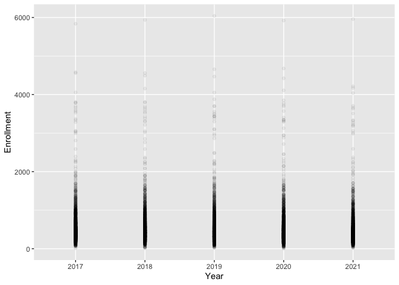
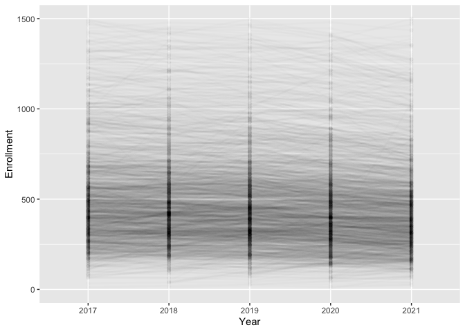
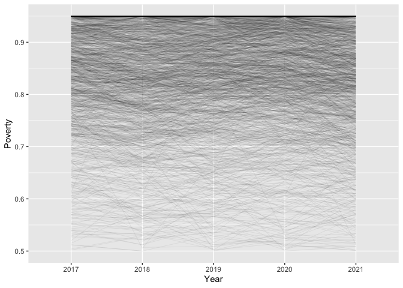
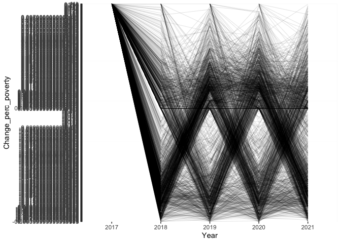
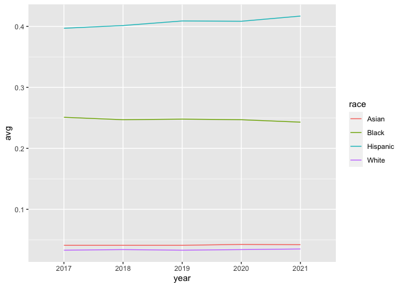
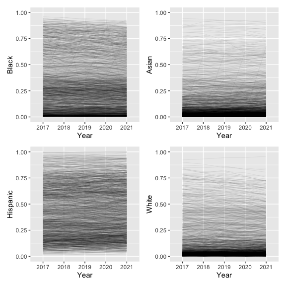
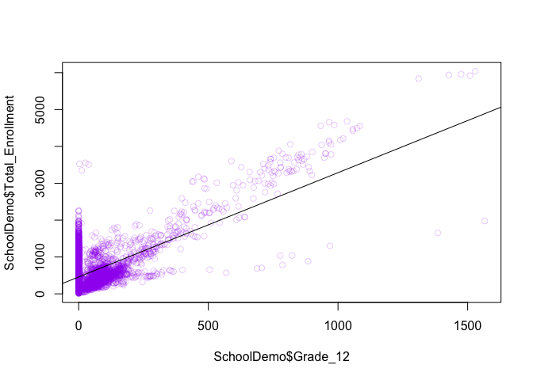
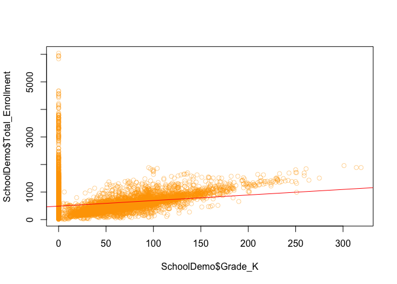
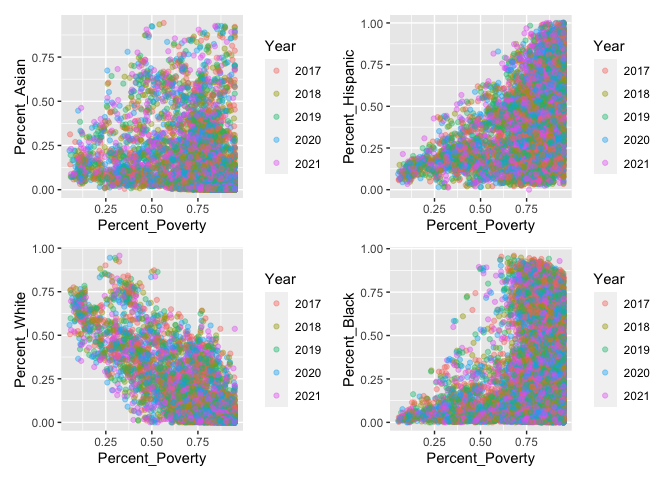

School Demographics v2
================
Elias Guerra
7/15/2022

## Is NYC racist? (You guessed it)

Data was retrieved from NYC Open Data. Check it:
<https://data.cityofnewyork.us/Education/2017-18-2021-22-Demographic-Snapshot/c7ru-d68s>

I realized after I created this for loop to compare percent poverty to
the previous year (see below) that it was redundant, but now you know I
can make for loops and things more complicated than they need to be. I’m
using the tidyverse library because it’s really useful for producing
really clean graphs and a sweet language for cleaning and massaging
data. See some cool graphs at the end. I’ve put my first attempt at
solving this at the bottom if you want to see my process.

``` r
# STARTING F ROM SCRATCH
  #Clean SchoolDemo
library(tidyverse)
(SchoolDemo <- read_csv("~/Documents/R/Datasets/2017_18__2021_22_Demographic_Snapshot.csv"))
```

    ## # A tibble: 9,251 x 44
    ##    DBN   `School Name` Year  `Total Enrollme… `Grade 3K` `Grade PK (Half…
    ##    <chr> <chr>         <chr>            <dbl>      <dbl>            <dbl>
    ##  1 01M0… P.S. 015 Rob… 2017…              190          0               17
    ##  2 01M0… P.S. 015 Rob… 2018…              174          0               13
    ##  3 01M0… P.S. 015 Rob… 2019…              190          0               14
    ##  4 01M0… P.S. 015 Rob… 2020…              193          0               17
    ##  5 01M0… P.S. 015 Rob… 2021…              179          0               15
    ##  6 01M0… P.S. 019 Ash… 2017…              257          0               13
    ##  7 01M0… P.S. 019 Ash… 2018…              249          0               10
    ##  8 01M0… P.S. 019 Ash… 2019…              236          0               16
    ##  9 01M0… P.S. 019 Ash… 2020…              212          0               13
    ## 10 01M0… P.S. 019 Ash… 2021…              176          9                7
    ## # … with 9,241 more rows, and 38 more variables: `Grade K` <dbl>, `Grade
    ## #   1` <dbl>, `Grade 2` <dbl>, `Grade 3` <dbl>, `Grade 4` <dbl>, `Grade
    ## #   5` <dbl>, `Grade 6` <dbl>, `Grade 7` <dbl>, `Grade 8` <dbl>, `Grade
    ## #   9` <dbl>, `Grade 10` <dbl>, `Grade 11` <dbl>, `Grade 12` <dbl>, `#
    ## #   Female` <dbl>, `% Female` <dbl>, `# Male` <dbl>, `% Male` <dbl>, `#
    ## #   Asian` <dbl>, `% Asian` <dbl>, `# Black` <dbl>, `% Black` <dbl>, `#
    ## #   Hispanic` <dbl>, `% Hispanic` <dbl>, `# Multi-Racial` <dbl>, `%
    ## #   Multi-Racial` <dbl>, `# Native American` <dbl>, `% Native
    ## #   American` <dbl>, `# White` <dbl>, `% White` <dbl>, `# Missing
    ## #   Race/Ethnicity Data` <dbl>, `% Missing Race/Ethnicity Data` <dbl>, `#
    ## #   Students with Disabilities` <dbl>, `% Students with
    ## #   Disabilities` <dbl>, `# English Language Learners` <dbl>, `% English
    ## #   Language Learners` <dbl>, `# Poverty` <chr>, `% Poverty` <chr>,
    ## #   `Economic Need Index` <chr>

``` r
SchoolDemo$Year  <- substr(SchoolDemo$Year, 1, 4)


#new cleaner supremer School Demographics
  # cleaning up school names
newSchoolDemo <- select(SchoolDemo, 
                        School = `School Name`, 
                        Year = Year,
                        Enrollment = `Total Enrollment`,
                        Black = `% Black`,
                        Asian = `% Asian`,
                        White = `% White`,
                        Hispanic = `% Hispanic`,
                        Poverty = `% Poverty`)
newSchoolDemo$Poverty <- parse_number(newSchoolDemo$Poverty)/100
str(newSchoolDemo)
```

    ## tibble [9,251 × 8] (S3: spec_tbl_df/tbl_df/tbl/data.frame)
    ##  $ School    : chr [1:9251] "P.S. 015 Roberto Clemente" "P.S. 015 Roberto Clemente" "P.S. 015 Roberto Clemente" "P.S. 015 Roberto Clemente" ...
    ##  $ Year      : chr [1:9251] "2017" "2018" "2019" "2020" ...
    ##  $ Enrollment: num [1:9251] 190 174 190 193 179 257 249 236 212 176 ...
    ##  $ Black     : num [1:9251] 0.274 0.276 0.295 0.275 0.279 0.191 0.209 0.208 0.193 0.182 ...
    ##  $ Asian     : num [1:9251] 0.105 0.138 0.142 0.135 0.117 0.089 0.056 0.047 0.061 0.057 ...
    ##  $ White     : num [1:9251] 0.032 0.034 0.047 0.057 0.067 0.062 0.072 0.081 0.08 0.119 ...
    ##  $ Hispanic  : num [1:9251] 0.579 0.546 0.505 0.528 0.52 0.646 0.627 0.627 0.613 0.574 ...
    ##  $ Poverty   : num [1:9251] 0.847 0.845 0.816 0.834 0.838 0.77 0.735 0.746 0.717 0.705 ...
    ##  - attr(*, "spec")=
    ##   .. cols(
    ##   ..   DBN = col_character(),
    ##   ..   `School Name` = col_character(),
    ##   ..   Year = col_character(),
    ##   ..   `Total Enrollment` = col_double(),
    ##   ..   `Grade 3K` = col_double(),
    ##   ..   `Grade PK (Half Day & Full Day)` = col_double(),
    ##   ..   `Grade K` = col_double(),
    ##   ..   `Grade 1` = col_double(),
    ##   ..   `Grade 2` = col_double(),
    ##   ..   `Grade 3` = col_double(),
    ##   ..   `Grade 4` = col_double(),
    ##   ..   `Grade 5` = col_double(),
    ##   ..   `Grade 6` = col_double(),
    ##   ..   `Grade 7` = col_double(),
    ##   ..   `Grade 8` = col_double(),
    ##   ..   `Grade 9` = col_double(),
    ##   ..   `Grade 10` = col_double(),
    ##   ..   `Grade 11` = col_double(),
    ##   ..   `Grade 12` = col_double(),
    ##   ..   `# Female` = col_double(),
    ##   ..   `% Female` = col_double(),
    ##   ..   `# Male` = col_double(),
    ##   ..   `% Male` = col_double(),
    ##   ..   `# Asian` = col_double(),
    ##   ..   `% Asian` = col_double(),
    ##   ..   `# Black` = col_double(),
    ##   ..   `% Black` = col_double(),
    ##   ..   `# Hispanic` = col_double(),
    ##   ..   `% Hispanic` = col_double(),
    ##   ..   `# Multi-Racial` = col_double(),
    ##   ..   `% Multi-Racial` = col_double(),
    ##   ..   `# Native American` = col_double(),
    ##   ..   `% Native American` = col_double(),
    ##   ..   `# White` = col_double(),
    ##   ..   `% White` = col_double(),
    ##   ..   `# Missing Race/Ethnicity Data` = col_double(),
    ##   ..   `% Missing Race/Ethnicity Data` = col_double(),
    ##   ..   `# Students with Disabilities` = col_double(),
    ##   ..   `% Students with Disabilities` = col_double(),
    ##   ..   `# English Language Learners` = col_double(),
    ##   ..   `% English Language Learners` = col_double(),
    ##   ..   `# Poverty` = col_character(),
    ##   ..   `% Poverty` = col_character(),
    ##   ..   `Economic Need Index` = col_character()
    ##   .. )

I’m trying to count change in poverty here below but I really made it
more complicated than it needed to be. The regression later will show
that.

This for loop is going through each school and counting for how many
years there are data and calculating change in poverty.

``` r
#@)#$*(%#)$@(%*@$#%*@$#(%!(*@#%&)))*************
# START run from here 
school_names <- unique(SchoolDemo$`School Name`)
Poverty_Change <- vector()  # should be == school names x years (for each school)
Poverty_df <- vector(length = 3)
Howmanyyears <- vector() #How many years of data 

### FOR Go by each school and count changes in percent poverty over each year
for (i in school_names) { # Filter by school
      # i <- school_names[1] # EXAMPLE
      # print(i) # TESTING
  x <- filter(newSchoolDemo, School == i)
  years <- as.numeric(x$Year) #years available (1-5)
  Howmanyyears <- c(Howmanyyears, length(years))
  
    for (y in years) { # Compare this year and previous
          # y <- 2018 #  EXAMPLE
          # print(y) #TESTING
      poverty_yr <- x$Poverty[x$Year == y]
      poverty_yr_prev <- x$Poverty[x$Year == (y-1)]
      if (is_empty(poverty_yr_prev) == TRUE) {poverty_yr_prev <- NA} #if prev year empty then NA
      z <- poverty_yr - poverty_yr_prev # Difference in poverty (or NA)

      #Organize outputs
      Poverty_Change <- c(Poverty_Change, z)
      Poverty_df <- rbind(Poverty_df, 
                          c(i, y, z)) # school name, year, change in % poverty
    }
}
```

Organize and clean the outputs: We store the data in a “tibble”, Hadley
Wickam’s version of a dataframe. Then join the new dataset with the old
one.

``` r
# Clean Povety_df (change in percent poverty for each school for every year) 
# and combine with newSchoolDemo
Poverty_df <- as_tibble(Poverty_df)
Poverty_df<- Poverty_df[-1,] 
colnames(Poverty_df) <- c("School", "Year", "Change_perc_poverty")
newSchoolDemo <- left_join(newSchoolDemo, Poverty_df, by = c("School", "Year"))

# Count duplicates (how many years data at each school)
Duplicates_df <- tibble(
  School = unique(newSchoolDemo$School),
  Duplicates = newSchoolDemo$School %>% as_factor() %>% tabulate() 
)
newSchoolDemo <- left_join(newSchoolDemo, Duplicates_df, by = "School")

str(newSchoolDemo)
```

    ## tibble [9,401 × 10] (S3: spec_tbl_df/tbl_df/tbl/data.frame)
    ##  $ School             : chr [1:9401] "P.S. 015 Roberto Clemente" "P.S. 015 Roberto Clemente" "P.S. 015 Roberto Clemente" "P.S. 015 Roberto Clemente" ...
    ##  $ Year               : chr [1:9401] "2017" "2018" "2019" "2020" ...
    ##  $ Enrollment         : num [1:9401] 190 174 190 193 179 257 249 236 212 176 ...
    ##  $ Black              : num [1:9401] 0.274 0.276 0.295 0.275 0.279 0.191 0.209 0.208 0.193 0.182 ...
    ##  $ Asian              : num [1:9401] 0.105 0.138 0.142 0.135 0.117 0.089 0.056 0.047 0.061 0.057 ...
    ##  $ White              : num [1:9401] 0.032 0.034 0.047 0.057 0.067 0.062 0.072 0.081 0.08 0.119 ...
    ##  $ Hispanic           : num [1:9401] 0.579 0.546 0.505 0.528 0.52 0.646 0.627 0.627 0.613 0.574 ...
    ##  $ Poverty            : num [1:9401] 0.847 0.845 0.816 0.834 0.838 0.77 0.735 0.746 0.717 0.705 ...
    ##  $ Change_perc_poverty: chr [1:9401] NA "-0.002" "-0.029" "0.0180000000000001" ...
    ##  $ Duplicates         : int [1:9401] 5 5 5 5 5 5 5 5 5 5 ...

So we’ve added change in poverty for each school each year.

Below, a p ossible negative binomial distribution for each year. Each
point represents a school

``` r
# DATA IS CLEAN NOW!!
#analyzzzze

#First look: Enrollment
ggplot(newSchoolDemo, aes(x = Year, y = Enrollment, group = School)) +
  geom_point(alpha = .05)
```

<!-- -->

Connecting the dots but not obvious trends I see.

``` r
# Zoomed in and connecting each school over years
# ENROLLMENT
ggplot(newSchoolDemo, aes(x = Year, y = Enrollment, group = School)) +
  geom_point(alpha = .01) +
  geom_line(alpha = .01, size= 1.1) +
  ylim(0, 1500)
```

<!-- -->

``` r
  # Not much going on here
```

Poverty is high.

``` r
# POVERTY
#First look
ggplot(newSchoolDemo, aes(x = Year, y = Poverty, group = School)) +
  geom_point(alpha = .05)
```

<!-- -->

``` r
#Zoomed in
# Made the lines darker and skinnier
ggplot(newSchoolDemo, aes(x = Year, y = Poverty, group = School)) +
  geom_line(alpha = .1, size= .2) +
  ylim(.5,.95)
```

<!-- -->

``` r
  # Poverty is very high and does not seem to increase or change much
  ggplot(newSchoolDemo, aes(x = Year, y = Poverty, group = School)) +
  geom_line(alpha = .2, size= .2) +
  ylim(.8,.95) #same
```

<!-- -->

``` r
#CHANGE IN POVERTY
  ggplot(newSchoolDemo, aes(x = Year, y = Change_perc_poverty, group = School)) +
    geom_line(alpha = .2, size= .2) # idk tf
```

<!-- -->

Idk.

Next, we’re going to look at race. I used the internal data set Iris to
remember how to use tapply(), which can be used to apply a function
across vectors (columns basically).

``` r
# HOW TO USE TAPPLY
# self-refresher
data("iris")
head(iris)
```

    ##   Sepal.Length Sepal.Width Petal.Length Petal.Width Species
    ## 1          5.1         3.5          1.4         0.2  setosa
    ## 2          4.9         3.0          1.4         0.2  setosa
    ## 3          4.7         3.2          1.3         0.2  setosa
    ## 4          4.6         3.1          1.5         0.2  setosa
    ## 5          5.0         3.6          1.4         0.2  setosa
    ## 6          5.4         3.9          1.7         0.4  setosa

``` r
tapply(iris$Sepal.Width, iris$Species, median)
```

    ##     setosa versicolor  virginica 
    ##        3.4        2.8        3.0

``` r
# Average of Black students
tapply(newSchoolDemo$Black, newSchoolDemo$School, median) %>% head
```

    ## 47 The American Sign Language and English Secondar 
    ##                                              0.250 
    ##                                 A-Tech High School 
    ##                                              0.441 
    ##              A. Philip Randolph Campus High School 
    ##                                              0.288 
    ## A.C.E. Academy for Scholars at the Geraldine Ferra 
    ##                                              0.024 
    ##                        Abraham Lincoln High School 
    ##                                              0.410 
    ##                 Academic Leadership Charter School 
    ##                                              0.457

``` r
  newSchoolDemo$Black[newSchoolDemo$School == "A-Tech High School"] %>% median() #check
```

    ## [1] 0.441

Here this for loop is going to capture the median percent of students
there is at each school.

``` r
# FOR CAPTURE AVERAGE % RACE FOR EACH YEAR
Average_per_race <- vector(length = 5)
for (i in c("Black", "White", "Asian", "Hispanic")) {
  d <- tapply( as_vector(newSchoolDemo[,i]), newSchoolDemo$Year, median)
  new_row <- c(race = i, d)
  Average_per_race <- rbind(Average_per_race, new_row)
}
Average_per_race <- Average_per_race[-1,] 
Average_per_race <- as_tibble(Average_per_race)
# Buuuutt we want years as their own column
# and all races combined into one column for pretty graphs
Average_per_race <- pivot_longer(Average_per_race, cols = 2:6, names_to = "year", values_to = "avg") #sexy
Average_per_race$avg <- as.numeric(Average_per_race$avg)

head(Average_per_race)
```

    ## # A tibble: 6 x 3
    ##   race  year    avg
    ##   <chr> <chr> <dbl>
    ## 1 Black 2017  0.251
    ## 2 Black 2018  0.247
    ## 3 Black 2019  0.248
    ## 4 Black 2020  0.247
    ## 5 Black 2021  0.243
    ## 6 White 2017  0.033

And this is a plot showing those averages over four years. Percentage of
Hispanic students might be going up and black students down.

``` r
# PLOT
ggplot(Average_per_race, aes(x = year, y = avg, group = race, color = race)) +
  geom_line() 
```

<!-- -->

``` r
ggplot() + 
  geom_line(data = newSchoolDemo, aes(x = Year, y = White, group = School), alpha = .1, size= .2) +
  geom_line(data = newSchoolDemo, aes(x = Year, y = Asian, group = School), alpha = .1, size= .2) +
  geom_line(data = newSchoolDemo, aes(x = Year, y = Black, group = School), alpha = .1, size= .2) +
  geom_line(data = newSchoolDemo, aes(x = Year, y = Hispanic, group = School), alpha = .1, size= .2) +
  geom_line(data = Average_per_race, aes(x = year, y = avg, group = race, color = race)) + 
  ylim(0,1)
```

<!-- -->

``` r
# Wow we can see each school and the averages (Median remember) for each race super imposed.
```

Though this would be useful but kind of hard to get anything useful if
you ask me. Each color line represent students at a school.

``` r
# Divided by color? 
ggplot() + 
  geom_line(data = newSchoolDemo, aes(x = Year, y = White, group = School), alpha = .05, size= .2, color = "Purple") +
  geom_line(data = newSchoolDemo, aes(x = Year, y = Asian, group = School), alpha = .05, size= .2, color = "Red") + 
  geom_line(data = newSchoolDemo, aes(x = Year, y = Black, group = School), alpha = .05, size= .2, color = "Green") +
  geom_line(data = newSchoolDemo, aes(x = Year, y = Hispanic, group = School), alpha = .05, size= .2, color = "Blue") 
```

<!-- -->

``` r
#Not super useful
```

<https://open.spotify.com/track/6Uc3HO6WzLPVF2dhE3iEhp?si=77bdde7014c3497f>

``` r
# This is my fav
  # BLACK
  bd <- ggplot(newSchoolDemo, aes(x = Year, y = Black, group = School)) +
    geom_line(alpha = .1, size= .2) +
    ylim(0,1)# wow super low :(
  # ASIAN
  ad <- ggplot(newSchoolDemo, aes(x = Year, y = Asian, group = School)) +
    geom_line(alpha = .1, size= .2) +
    ylim(0,1)
  #HISPANIC
  hd <- ggplot(newSchoolDemo, aes(x = Year, y = Hispanic, group = School)) +
    geom_line(alpha = .1, size= .2) +
    ylim(0,1)
  # WHITE
  wd <- ggplot(newSchoolDemo, aes(x = Year, y = White, group = School)) +
    geom_line(alpha = .1, size= .2) +
    ylim(0,1)
  
#install.packages("patchwork")
library(patchwork)
# GRAPHING ALL RACES
bd + ad + hd + wd
```

<!-- -->

From this last set of graphs you can see the distribution over 4 years
of different ethnicities. Each line represent one school, so each graphs
shows all the school at once. It looks like the majority of schools have
no White or Asian students and lots of schools have not black students.
Hispanic students seem to never be absent in all schools but there is
lots of variation.

*My opinion on the matter:*

<https://ny.chalkbeat.org/2021/10/15/22728581/nyc-school-segregation-integratenyc-lawsuit-gifted>

<https://www.reuters.com/article/us-new-york-schools-racism/new-york-city-school-segregation-perpetuates-racism-lawsuit-contends-idUSKBN2B11WI>

## REGRESSION ANALYSIS

Behold, math. Let’s take a look at the effect that COVID had on
different age groups and see if there’s any statistic differences. Lets
take a look at how often Black, White and Asian students overlap in the
schools they’re at (our last analysis showed Hispanic students are
present in most schools).

``` r
SchoolDemo
```

    ## # A tibble: 9,251 x 44
    ##    DBN   `School Name` Year  `Total Enrollme… `Grade 3K` `Grade PK (Half…
    ##    <chr> <chr>         <chr>            <dbl>      <dbl>            <dbl>
    ##  1 01M0… P.S. 015 Rob… 2017               190          0               17
    ##  2 01M0… P.S. 015 Rob… 2018               174          0               13
    ##  3 01M0… P.S. 015 Rob… 2019               190          0               14
    ##  4 01M0… P.S. 015 Rob… 2020               193          0               17
    ##  5 01M0… P.S. 015 Rob… 2021               179          0               15
    ##  6 01M0… P.S. 019 Ash… 2017               257          0               13
    ##  7 01M0… P.S. 019 Ash… 2018               249          0               10
    ##  8 01M0… P.S. 019 Ash… 2019               236          0               16
    ##  9 01M0… P.S. 019 Ash… 2020               212          0               13
    ## 10 01M0… P.S. 019 Ash… 2021               176          9                7
    ## # … with 9,241 more rows, and 38 more variables: `Grade K` <dbl>, `Grade
    ## #   1` <dbl>, `Grade 2` <dbl>, `Grade 3` <dbl>, `Grade 4` <dbl>, `Grade
    ## #   5` <dbl>, `Grade 6` <dbl>, `Grade 7` <dbl>, `Grade 8` <dbl>, `Grade
    ## #   9` <dbl>, `Grade 10` <dbl>, `Grade 11` <dbl>, `Grade 12` <dbl>, `#
    ## #   Female` <dbl>, `% Female` <dbl>, `# Male` <dbl>, `% Male` <dbl>, `#
    ## #   Asian` <dbl>, `% Asian` <dbl>, `# Black` <dbl>, `% Black` <dbl>, `#
    ## #   Hispanic` <dbl>, `% Hispanic` <dbl>, `# Multi-Racial` <dbl>, `%
    ## #   Multi-Racial` <dbl>, `# Native American` <dbl>, `% Native
    ## #   American` <dbl>, `# White` <dbl>, `% White` <dbl>, `# Missing
    ## #   Race/Ethnicity Data` <dbl>, `% Missing Race/Ethnicity Data` <dbl>, `#
    ## #   Students with Disabilities` <dbl>, `% Students with
    ## #   Disabilities` <dbl>, `# English Language Learners` <dbl>, `% English
    ## #   Language Learners` <dbl>, `# Poverty` <chr>, `% Poverty` <chr>,
    ## #   `Economic Need Index` <chr>

``` r
colnames(SchoolDemo) <- colnames(SchoolDemo) %>% 
  str_replace("%", "Percent") %>% 
  str_replace("#", "Numbr") %>% 
  str_replace_all(" ", "_")
SchoolDemo$Percent_Poverty <- parse_number(SchoolDemo$Percent_Poverty)/100
str(SchoolDemo)
```

    ## tibble [9,251 × 44] (S3: spec_tbl_df/tbl_df/tbl/data.frame)
    ##  $ DBN                                : chr [1:9251] "01M015" "01M015" "01M015" "01M015" ...
    ##  $ School_Name                        : chr [1:9251] "P.S. 015 Roberto Clemente" "P.S. 015 Roberto Clemente" "P.S. 015 Roberto Clemente" "P.S. 015 Roberto Clemente" ...
    ##  $ Year                               : chr [1:9251] "2017" "2018" "2019" "2020" ...
    ##  $ Total_Enrollment                   : num [1:9251] 190 174 190 193 179 257 249 236 212 176 ...
    ##  $ Grade_3K                           : num [1:9251] 0 0 0 0 0 0 0 0 0 9 ...
    ##  $ Grade_PK_(Half_Day_&_Full_Day)     : num [1:9251] 17 13 14 17 15 13 10 16 13 7 ...
    ##  $ Grade_K                            : num [1:9251] 28 20 29 29 30 34 30 25 23 22 ...
    ##  $ Grade_1                            : num [1:9251] 32 33 28 29 26 38 39 27 25 20 ...
    ##  $ Grade_2                            : num [1:9251] 33 30 38 27 24 42 43 39 27 22 ...
    ##  $ Grade_3                            : num [1:9251] 23 30 33 30 22 46 41 45 38 23 ...
    ##  $ Grade_4                            : num [1:9251] 31 20 29 32 33 42 44 42 44 34 ...
    ##  $ Grade_5                            : num [1:9251] 26 28 19 29 29 42 42 42 42 39 ...
    ##  $ Grade_6                            : num [1:9251] 0 0 0 0 0 0 0 0 0 0 ...
    ##  $ Grade_7                            : num [1:9251] 0 0 0 0 0 0 0 0 0 0 ...
    ##  $ Grade_8                            : num [1:9251] 0 0 0 0 0 0 0 0 0 0 ...
    ##  $ Grade_9                            : num [1:9251] 0 0 0 0 0 0 0 0 0 0 ...
    ##  $ Grade_10                           : num [1:9251] 0 0 0 0 0 0 0 0 0 0 ...
    ##  $ Grade_11                           : num [1:9251] 0 0 0 0 0 0 0 0 0 0 ...
    ##  $ Grade_12                           : num [1:9251] 0 0 0 0 0 0 0 0 0 0 ...
    ##  $ Numbr_Female                       : num [1:9251] 99 85 94 101 96 114 114 110 99 83 ...
    ##  $ Percent_Female                     : num [1:9251] 0.521 0.489 0.495 0.523 0.536 0.444 0.458 0.466 0.467 0.472 ...
    ##  $ Numbr_Male                         : num [1:9251] 91 89 96 92 83 143 135 126 113 93 ...
    ##  $ Percent_Male                       : num [1:9251] 0.479 0.511 0.505 0.477 0.464 0.556 0.542 0.534 0.533 0.528 ...
    ##  $ Numbr_Asian                        : num [1:9251] 20 24 27 26 21 23 14 11 13 10 ...
    ##  $ Percent_Asian                      : num [1:9251] 0.105 0.138 0.142 0.135 0.117 0.089 0.056 0.047 0.061 0.057 ...
    ##  $ Numbr_Black                        : num [1:9251] 52 48 56 53 50 49 52 49 41 32 ...
    ##  $ Percent_Black                      : num [1:9251] 0.274 0.276 0.295 0.275 0.279 0.191 0.209 0.208 0.193 0.182 ...
    ##  $ Numbr_Hispanic                     : num [1:9251] 110 95 96 102 93 166 156 148 130 101 ...
    ##  $ Percent_Hispanic                   : num [1:9251] 0.579 0.546 0.505 0.528 0.52 0.646 0.627 0.627 0.613 0.574 ...
    ##  $ Numbr_Multi-Racial                 : num [1:9251] 1 0 0 1 3 3 8 8 7 8 ...
    ##  $ Percent_Multi-Racial               : num [1:9251] 0.005 0 0 0.005 0.017 0.012 0.032 0.034 0.033 0.045 ...
    ##  $ Numbr_Native_American              : num [1:9251] 1 1 2 0 0 0 1 1 1 1 ...
    ##  $ Percent_Native_American            : num [1:9251] 0.005 0.006 0.011 0 0 0 0.004 0.004 0.005 0.006 ...
    ##  $ Numbr_White                        : num [1:9251] 6 6 9 11 12 16 18 19 17 21 ...
    ##  $ Percent_White                      : num [1:9251] 0.032 0.034 0.047 0.057 0.067 0.062 0.072 0.081 0.08 0.119 ...
    ##  $ Numbr_Missing_Race/Ethnicity_Data  : num [1:9251] 0 0 0 0 0 0 0 0 3 3 ...
    ##  $ Percent_Missing_Race/Ethnicity_Data: num [1:9251] 0 0 0 0 0 0 0 0 0.014 0.017 ...
    ##  $ Numbr_Students_with_Disabilities   : num [1:9251] 49 39 46 44 38 90 102 94 87 72 ...
    ##  $ Percent_Students_with_Disabilities : num [1:9251] 0.258 0.224 0.242 0.228 0.212 0.35 0.41 0.398 0.41 0.409 ...
    ##  $ Numbr_English_Language_Learners    : num [1:9251] 8 8 17 21 11 8 8 8 9 6 ...
    ##  $ Percent_English_Language_Learners  : num [1:9251] 0.042 0.046 0.089 0.109 0.061 0.031 0.032 0.034 0.042 0.034 ...
    ##  $ Numbr_Poverty                      : chr [1:9251] "161" "147" "155" "161" ...
    ##  $ Percent_Poverty                    : num [1:9251] 0.847 0.845 0.816 0.834 0.838 0.77 0.735 0.746 0.717 0.705 ...
    ##  $ Economic_Need_Index                : chr [1:9251] "89.0%" "88.8%" "86.7%" "86.4%" ...
    ##  - attr(*, "spec")=
    ##   .. cols(
    ##   ..   DBN = col_character(),
    ##   ..   `School Name` = col_character(),
    ##   ..   Year = col_character(),
    ##   ..   `Total Enrollment` = col_double(),
    ##   ..   `Grade 3K` = col_double(),
    ##   ..   `Grade PK (Half Day & Full Day)` = col_double(),
    ##   ..   `Grade K` = col_double(),
    ##   ..   `Grade 1` = col_double(),
    ##   ..   `Grade 2` = col_double(),
    ##   ..   `Grade 3` = col_double(),
    ##   ..   `Grade 4` = col_double(),
    ##   ..   `Grade 5` = col_double(),
    ##   ..   `Grade 6` = col_double(),
    ##   ..   `Grade 7` = col_double(),
    ##   ..   `Grade 8` = col_double(),
    ##   ..   `Grade 9` = col_double(),
    ##   ..   `Grade 10` = col_double(),
    ##   ..   `Grade 11` = col_double(),
    ##   ..   `Grade 12` = col_double(),
    ##   ..   `# Female` = col_double(),
    ##   ..   `% Female` = col_double(),
    ##   ..   `# Male` = col_double(),
    ##   ..   `% Male` = col_double(),
    ##   ..   `# Asian` = col_double(),
    ##   ..   `% Asian` = col_double(),
    ##   ..   `# Black` = col_double(),
    ##   ..   `% Black` = col_double(),
    ##   ..   `# Hispanic` = col_double(),
    ##   ..   `% Hispanic` = col_double(),
    ##   ..   `# Multi-Racial` = col_double(),
    ##   ..   `% Multi-Racial` = col_double(),
    ##   ..   `# Native American` = col_double(),
    ##   ..   `% Native American` = col_double(),
    ##   ..   `# White` = col_double(),
    ##   ..   `% White` = col_double(),
    ##   ..   `# Missing Race/Ethnicity Data` = col_double(),
    ##   ..   `% Missing Race/Ethnicity Data` = col_double(),
    ##   ..   `# Students with Disabilities` = col_double(),
    ##   ..   `% Students with Disabilities` = col_double(),
    ##   ..   `# English Language Learners` = col_double(),
    ##   ..   `% English Language Learners` = col_double(),
    ##   ..   `# Poverty` = col_character(),
    ##   ..   `% Poverty` = col_character(),
    ##   ..   `Economic Need Index` = col_character()
    ##   .. )

``` r
# Pre-k vs enrollment
lm_gk <- lm(Total_Enrollment ~ Grade_K, data = SchoolDemo)
summary(lm_gk)
```

    ## 
    ## Call:
    ## lm(formula = Total_Enrollment ~ Grade_K, data = SchoolDemo)
    ## 
    ## Residuals:
    ##    Min     1Q Median     3Q    Max 
    ## -605.8 -230.0  -99.7   61.2 5550.6 
    ## 
    ## Coefficients:
    ##             Estimate Std. Error t value Pr(>|t|)    
    ## (Intercept) 489.3543     6.3040   77.63   <2e-16 ***
    ## Grade_K       2.0213     0.1003   20.16   <2e-16 ***
    ## ---
    ## Signif. codes:  0 '***' 0.001 '**' 0.01 '*' 0.05 '.' 0.1 ' ' 1
    ## 
    ## Residual standard error: 459.9 on 9249 degrees of freedom
    ## Multiple R-squared:  0.0421, Adjusted R-squared:  0.042 
    ## F-statistic: 406.5 on 1 and 9249 DF,  p-value: < 2.2e-16

``` r
plot(SchoolDemo$Grade_K, SchoolDemo$Total_Enrollment, col = alpha("orange", .2))
abline(lm_gk, col = "red")
```

<!-- -->

``` r
# Adjusted R-squared:  0.042 
# Estimate Std. Error t value Pr(>|t|)    
#   Grade_K       2.0213     0.1003   20.16   <2e-16 ***

# Grade 12 vs enrollment
lm_g12 <- lm(Total_Enrollment ~ Grade_12, data = SchoolDemo)
summary(lm_g12)
```

    ## 
    ## Call:
    ## lm(formula = Total_Enrollment ~ Grade_12, data = SchoolDemo)
    ## 
    ## Residuals:
    ##      Min       1Q   Median       3Q      Max 
    ## -2912.36  -250.24   -74.24   157.26  3061.27 
    ## 
    ## Coefficients:
    ##              Estimate Std. Error t value Pr(>|t|)    
    ## (Intercept) 458.24087    3.92494  116.75   <2e-16 ***
    ## Grade_12      2.82894    0.03373   83.86   <2e-16 ***
    ## ---
    ## Signif. codes:  0 '***' 0.001 '**' 0.01 '*' 0.05 '.' 0.1 ' ' 1
    ## 
    ## Residual standard error: 354.2 on 9249 degrees of freedom
    ## Multiple R-squared:  0.4319, Adjusted R-squared:  0.4319 
    ## F-statistic:  7033 on 1 and 9249 DF,  p-value: < 2.2e-16

``` r
plot(SchoolDemo$Grade_12, SchoolDemo$Total_Enrollment, col = alpha("purple", .2))
abline(lm_g12)
```

<!-- -->

``` r
# Adjusted R-squared:  0.4319 
# Estimate Std. Error t value Pr(>|t|)    
#   Grade_12      2.82894    0.03373   83.86   <2e-16 ***
```

Pre-K and 12th Grade attendance are both significant predictors of
enrollment. Older students’ attendance was much more predictive (higher
R-squared).

``` r
#Comparing enrollment of each race (Each point represents a school)
bvh <- ggplot(SchoolDemo, aes(y= Percent_Black, x= Percent_Hispanic, color = Year)) +  geom_point(alpha = .1)
wva <- ggplot(SchoolDemo, aes(x = Percent_White, y = Percent_Asian, color = Year)) +  geom_point(alpha = .1)
bvw <- ggplot(SchoolDemo, aes(y = Percent_Black, x = Percent_White, color = Year)) +  geom_point(alpha = .2)
hva <- ggplot(SchoolDemo, aes(y= Percent_Hispanic, x= Percent_Asian, color = Year)) +   geom_point(alpha = .1)
bvh + bvw + hva + wva
```

<!-- -->

White and Asian students tend to go to school where population of Black
and Hispanic students are lower \# and where their white/asian
counterparts are higher. \# Either Black and Hispanic students are
segregating themselves or….

``` r
#Hispanic versus black student percent
lm_bh <- lm(Percent_Hispanic ~ Percent_Black, data = SchoolDemo)
summary(lm_bh)
```

    ## 
    ## Call:
    ## lm(formula = Percent_Hispanic ~ Percent_Black, data = SchoolDemo)
    ## 
    ## Residuals:
    ##      Min       1Q   Median       3Q      Max 
    ## -0.55669 -0.13904 -0.00104  0.18772  0.44331 
    ## 
    ## Coefficients:
    ##                Estimate Std. Error t value Pr(>|t|)    
    ## (Intercept)    0.556692   0.003609  154.24   <2e-16 ***
    ## Percent_Black -0.408187   0.008978  -45.47   <2e-16 ***
    ## ---
    ## Signif. codes:  0 '***' 0.001 '**' 0.01 '*' 0.05 '.' 0.1 ' ' 1
    ## 
    ## Residual standard error: 0.2248 on 9249 degrees of freedom
    ## Multiple R-squared:  0.1827, Adjusted R-squared:  0.1826 
    ## F-statistic:  2067 on 1 and 9249 DF,  p-value: < 2.2e-16

``` r
plot(SchoolDemo$Percent_Black, SchoolDemo$Percent_Hispanic, col = alpha("purple", .2))
abline(lm_bh)
```

<!-- -->

``` r
# Multiple R-squared:  0.1827,  Adjusted R-squared:  0.1826 
#   Estimate Std. Error t value Pr(>|t|)    
#   Percent_Black -0.408187   0.008978  -45.47   <2e-16 ***


#White versus Asian
lm_wa <- lm(Percent_Asian ~ Percent_White, data = SchoolDemo)
summary(lm_wa)
```

    ## 
    ## Call:
    ## lm(formula = Percent_Asian ~ Percent_White, data = SchoolDemo)
    ## 
    ## Residuals:
    ##      Min       1Q   Median       3Q      Max 
    ## -0.26617 -0.08629 -0.06778  0.01117  0.84734 
    ## 
    ## Coefficients:
    ##               Estimate Std. Error t value Pr(>|t|)    
    ## (Intercept)   0.092312   0.002041   45.23   <2e-16 ***
    ## Percent_White 0.196672   0.009726   20.22   <2e-16 ***
    ## ---
    ## Signif. codes:  0 '***' 0.001 '**' 0.01 '*' 0.05 '.' 0.1 ' ' 1
    ## 
    ## Residual standard error: 0.1619 on 9249 degrees of freedom
    ## Multiple R-squared:  0.04234,    Adjusted R-squared:  0.04223 
    ## F-statistic: 408.9 on 1 and 9249 DF,  p-value: < 2.2e-16

``` r
plot(SchoolDemo$Percent_White, SchoolDemo$Percent_Asian, col = alpha("purple", .2))
abline(lm_wa)
```

<!-- -->

``` r
#   Estimate Std. Error t value Pr(>|t|)    
#   Percent_White 0.196672   0.009726   20.22   <2e-16 ***
# Multiple R-squared:  0.04234, Adjusted R-squared:  0.04223


# Lets look at Native Americans and poverty
# https://open.spotify.com/track/2lJH4jsHg7CgxtaNjIJa95?si=ed4eb931cff541ee
pva <- ggplot(SchoolDemo, aes(x = Percent_Poverty, y = Percent_Asian, color = Year)) +  geom_point(alpha = .4)
pvh <- ggplot(SchoolDemo, aes(x= Percent_Poverty, y= Percent_Hispanic, color = Year)) +  geom_point(alpha = .4) 
pvw <- ggplot(SchoolDemo, aes(x = Percent_Poverty, y = Percent_White, color = Year)) +  geom_point(alpha = .4)
pvb <- ggplot(SchoolDemo, aes(x= Percent_Poverty, y= Percent_Black, color = Year)) +   geom_point(alpha = .4)
pva + pvh + pvw + pvb 
```

<!-- -->

``` r
#White
lm_povertyW <- lm(Percent_White ~ Percent_Poverty, data = SchoolDemo)
summary(lm_povertyW)
```

    ## 
    ## Call:
    ## lm(formula = Percent_White ~ Percent_Poverty, data = SchoolDemo)
    ## 
    ## Residuals:
    ##      Min       1Q   Median       3Q      Max 
    ## -0.37641 -0.05697 -0.00614  0.03056  0.56933 
    ## 
    ## Coefficients:
    ##                  Estimate Std. Error t value Pr(>|t|)    
    ## (Intercept)      0.682752   0.004514   151.3   <2e-16 ***
    ## Percent_Poverty -0.730853   0.005679  -128.7   <2e-16 ***
    ## ---
    ## Signif. codes:  0 '***' 0.001 '**' 0.01 '*' 0.05 '.' 0.1 ' ' 1
    ## 
    ## Residual standard error: 0.1036 on 9249 degrees of freedom
    ## Multiple R-squared:  0.6417, Adjusted R-squared:  0.6417 
    ## F-statistic: 1.656e+04 on 1 and 9249 DF,  p-value: < 2.2e-16

``` r
plot(SchoolDemo$Percent_Poverty, SchoolDemo$Percent_White, col = alpha("purple", .2))
abline(lm_povertyW)
```

<!-- -->

``` r
# Multiple R-squared:  0.6417,  Adjusted R-squared:  0.6417 
#   Estimate Std. Error t value Pr(>|t|)    
#   Percent_Poverty -7.309e-03  5.679e-05  -128.7   <2e-16 ***

#Hispanic
lm_povertyH <- lm(Percent_Hispanic ~ Percent_Poverty, data = SchoolDemo)
summary(lm_povertyH)
```

    ## 
    ## Call:
    ## lm(formula = Percent_Hispanic ~ Percent_Poverty, data = SchoolDemo)
    ## 
    ## Residuals:
    ##      Min       1Q   Median       3Q      Max 
    ## -0.51045 -0.17704  0.02065  0.16038  0.55417 
    ## 
    ## Coefficients:
    ##                  Estimate Std. Error t value Pr(>|t|)    
    ## (Intercept)     -0.057146   0.009485  -6.025 1.76e-09 ***
    ## Percent_Poverty  0.633256   0.011934  53.065  < 2e-16 ***
    ## ---
    ## Signif. codes:  0 '***' 0.001 '**' 0.01 '*' 0.05 '.' 0.1 ' ' 1
    ## 
    ## Residual standard error: 0.2177 on 9249 degrees of freedom
    ## Multiple R-squared:  0.2334, Adjusted R-squared:  0.2333 
    ## F-statistic:  2816 on 1 and 9249 DF,  p-value: < 2.2e-16

``` r
plot(SchoolDemo$Percent_Poverty, SchoolDemo$Percent_Hispanic, col = alpha("purple", .2))
abline(lm_povertyH)
```

<!-- -->

``` r
# Multiple R-squared:  0.2334,  Adjusted R-squared:  0.2333 
#   Estimate Std. Error t value Pr(>|t|)    
#   Percent_Poverty  0.633256   0.011934  53.065  < 2e-16 ***

#Black
lm_povertyB <- lm(Percent_Black ~ Percent_Poverty, data = SchoolDemo)
summary(lm_povertyB)
```

    ## 
    ## Call:
    ## lm(formula = Percent_Black ~ Percent_Poverty, data = SchoolDemo)
    ## 
    ## Residuals:
    ##      Min       1Q   Median       3Q      Max 
    ## -0.38174 -0.18568 -0.05926  0.14884  0.71491 
    ## 
    ## Coefficients:
    ##                 Estimate Std. Error t value Pr(>|t|)    
    ## (Intercept)     -0.02039    0.01079   -1.89   0.0588 .  
    ## Percent_Poverty  0.42330    0.01358   31.18   <2e-16 ***
    ## ---
    ## Signif. codes:  0 '***' 0.001 '**' 0.01 '*' 0.05 '.' 0.1 ' ' 1
    ## 
    ## Residual standard error: 0.2477 on 9249 degrees of freedom
    ## Multiple R-squared:  0.09512,    Adjusted R-squared:  0.09502 
    ## F-statistic: 972.2 on 1 and 9249 DF,  p-value: < 2.2e-16

``` r
plot(SchoolDemo$Percent_Poverty, SchoolDemo$Percent_Black, col = alpha("purple", .2))
abline(lm_povertyB)
```

<!-- -->

``` r
# Multiple R-squared:  0.09512, Adjusted R-squared:  0.09502 
# Estimate Std. Error t value Pr(>|t|)    
# Percent_Poverty  0.42330    0.01358   31.18   <2e-16 ***

#Asian
lm_povertyA <- lm(Percent_Asian ~ Percent_Poverty, data = SchoolDemo)
summary(lm_povertyA)
```

    ## 
    ## Call:
    ## lm(formula = Percent_Asian ~ Percent_Poverty, data = SchoolDemo)
    ## 
    ## Residuals:
    ##      Min       1Q   Median       3Q      Max 
    ## -0.25107 -0.08100 -0.05931  0.01616  0.85069 
    ## 
    ## Coefficients:
    ##                  Estimate Std. Error t value Pr(>|t|)    
    ## (Intercept)      0.312061   0.006894   45.27   <2e-16 ***
    ## Percent_Poverty -0.254471   0.008673  -29.34   <2e-16 ***
    ## ---
    ## Signif. codes:  0 '***' 0.001 '**' 0.01 '*' 0.05 '.' 0.1 ' ' 1
    ## 
    ## Residual standard error: 0.1582 on 9249 degrees of freedom
    ## Multiple R-squared:  0.08515,    Adjusted R-squared:  0.08505 
    ## F-statistic: 860.9 on 1 and 9249 DF,  p-value: < 2.2e-16

``` r
plot(SchoolDemo$Percent_Poverty, SchoolDemo$Percent_Asian, col = alpha("purple", .2))
abline(lm_povertyA)
```

<!-- -->

``` r
# Multiple R-squared:  0.08515, Adjusted R-squared:  0.08505 
# Estimate Std. Error t value Pr(>|t|)    
#   Percent_Poverty -0.254471   0.008673  -29.34   <2e-16 ***

#Native-American
lm_povertyNA <- lm(Percent_Native_American ~ Percent_Poverty, data = SchoolDemo)
summary(lm_povertyNA)
```

    ## 
    ## Call:
    ## lm(formula = Percent_Native_American ~ Percent_Poverty, data = SchoolDemo)
    ## 
    ## Residuals:
    ##      Min       1Q   Median       3Q      Max 
    ## -0.01320 -0.00823 -0.00472  0.00112  0.40623 
    ## 
    ## Coefficients:
    ##                  Estimate Std. Error t value Pr(>|t|)    
    ## (Intercept)     0.0055523  0.0009036   6.145 8.34e-10 ***
    ## Percent_Poverty 0.0080519  0.0011368   7.083 1.52e-12 ***
    ## ---
    ## Signif. codes:  0 '***' 0.001 '**' 0.01 '*' 0.05 '.' 0.1 ' ' 1
    ## 
    ## Residual standard error: 0.02074 on 9249 degrees of freedom
    ## Multiple R-squared:  0.005395,   Adjusted R-squared:  0.005287 
    ## F-statistic: 50.17 on 1 and 9249 DF,  p-value: 1.515e-12

``` r
plot(SchoolDemo$Percent_Poverty, SchoolDemo$Percent_Native_American, col = alpha("purple", .2))
abline(lm_povertyNA)
```

<!-- -->

``` r
#Taking a closer look at Native American school (Usually less than 10% of population)
plot(SchoolDemo$Percent_Poverty[SchoolDemo$Percent_Native_American <.1], SchoolDemo$Percent_Native_American[SchoolDemo$Percent_Native_American <.1], col = alpha("purple", .2))
```

<!-- -->

``` r
# Multiple R-squared:  0.005395,    Adjusted R-squared:  0.005287 
# Estimate Std. Error t value Pr(>|t|)    
#   Percent_Poverty 0.0080519  0.0011368   7.083 1.52e-12 ***
```

Analysis shows

## Blah blah blah

This was my first attempt to make this work with some notes. See below
for

``` r
library(tidyverse)
(SchoolDemo <- read_csv("~/Documents/R/Datasets/2017_18__2021_22_Demographic_Snapshot.csv"))
```

    ## # A tibble: 9,251 x 44
    ##    DBN   `School Name` Year  `Total Enrollme… `Grade 3K` `Grade PK (Half…
    ##    <chr> <chr>         <chr>            <dbl>      <dbl>            <dbl>
    ##  1 01M0… P.S. 015 Rob… 2017…              190          0               17
    ##  2 01M0… P.S. 015 Rob… 2018…              174          0               13
    ##  3 01M0… P.S. 015 Rob… 2019…              190          0               14
    ##  4 01M0… P.S. 015 Rob… 2020…              193          0               17
    ##  5 01M0… P.S. 015 Rob… 2021…              179          0               15
    ##  6 01M0… P.S. 019 Ash… 2017…              257          0               13
    ##  7 01M0… P.S. 019 Ash… 2018…              249          0               10
    ##  8 01M0… P.S. 019 Ash… 2019…              236          0               16
    ##  9 01M0… P.S. 019 Ash… 2020…              212          0               13
    ## 10 01M0… P.S. 019 Ash… 2021…              176          9                7
    ## # … with 9,241 more rows, and 38 more variables: `Grade K` <dbl>, `Grade
    ## #   1` <dbl>, `Grade 2` <dbl>, `Grade 3` <dbl>, `Grade 4` <dbl>, `Grade
    ## #   5` <dbl>, `Grade 6` <dbl>, `Grade 7` <dbl>, `Grade 8` <dbl>, `Grade
    ## #   9` <dbl>, `Grade 10` <dbl>, `Grade 11` <dbl>, `Grade 12` <dbl>, `#
    ## #   Female` <dbl>, `% Female` <dbl>, `# Male` <dbl>, `% Male` <dbl>, `#
    ## #   Asian` <dbl>, `% Asian` <dbl>, `# Black` <dbl>, `% Black` <dbl>, `#
    ## #   Hispanic` <dbl>, `% Hispanic` <dbl>, `# Multi-Racial` <dbl>, `%
    ## #   Multi-Racial` <dbl>, `# Native American` <dbl>, `% Native
    ## #   American` <dbl>, `# White` <dbl>, `% White` <dbl>, `# Missing
    ## #   Race/Ethnicity Data` <dbl>, `% Missing Race/Ethnicity Data` <dbl>, `#
    ## #   Students with Disabilities` <dbl>, `% Students with
    ## #   Disabilities` <dbl>, `# English Language Learners` <dbl>, `% English
    ## #   Language Learners` <dbl>, `# Poverty` <chr>, `% Poverty` <chr>,
    ## #   `Economic Need Index` <chr>

``` r
fivenum(SchoolDemo$`% Asian`) # Range of % Asian students (min, first quartile, median, third qrt, max)
```

    ## [1] 0.000 0.014 0.042 0.145 0.943

``` r
SchoolDemo %>% filter(`% Hispanic` == 0 ) #Which school had 0 Hispanic students
```

    ## # A tibble: 1 x 44
    ##   DBN   `School Name` Year  `Total Enrollme… `Grade 3K` `Grade PK (Half…
    ##   <chr> <chr>         <chr>            <dbl>      <dbl>            <dbl>
    ## 1 84X6… Earl Monroe … 2021…              118          0                0
    ## # … with 38 more variables: `Grade K` <dbl>, `Grade 1` <dbl>, `Grade
    ## #   2` <dbl>, `Grade 3` <dbl>, `Grade 4` <dbl>, `Grade 5` <dbl>, `Grade
    ## #   6` <dbl>, `Grade 7` <dbl>, `Grade 8` <dbl>, `Grade 9` <dbl>, `Grade
    ## #   10` <dbl>, `Grade 11` <dbl>, `Grade 12` <dbl>, `# Female` <dbl>, `%
    ## #   Female` <dbl>, `# Male` <dbl>, `% Male` <dbl>, `# Asian` <dbl>, `%
    ## #   Asian` <dbl>, `# Black` <dbl>, `% Black` <dbl>, `# Hispanic` <dbl>, `%
    ## #   Hispanic` <dbl>, `# Multi-Racial` <dbl>, `% Multi-Racial` <dbl>, `#
    ## #   Native American` <dbl>, `% Native American` <dbl>, `# White` <dbl>, `%
    ## #   White` <dbl>, `# Missing Race/Ethnicity Data` <dbl>, `% Missing
    ## #   Race/Ethnicity Data` <dbl>, `# Students with Disabilities` <dbl>, `%
    ## #   Students with Disabilities` <dbl>, `# English Language
    ## #   Learners` <dbl>, `% English Language Learners` <dbl>, `#
    ## #   Poverty` <chr>, `% Poverty` <chr>, `Economic Need Index` <chr>

``` r
# Also this ^ is how you use "pipes" in dplyr library to make things nice to look at.

Demo1 <- select(SchoolDemo, #Cleaning SchoolDemo
                     School = "School Name",
                     Enroll = 'Total Enrollment',
                     Black = '% Black', 
                     Hisp = '% Hispanic',
                     Asian = '% Asian',
                     White = '% White',
                     Poverty = '% Poverty')
Demo1$Year <- substr(SchoolDemo$Year, 1, 4) #fix "year" to remove range (eg. 2017-18 --> 2017)
# Demo1$change2018 <- filter(Demo1, year == 2018) - filter(Demo1, year == 2017)
  # We can't compare 2017 and 2018 here because the columns are not the same length.
  # Not every school has data for 2017 and 2018
  # But we need this to calculate percent change for each year
  # Time to remove school for which we have incomplete data
  school_names <- unique(Demo1$School)
  x <- Demo1[Demo1$School == school_names[1],] 
  #(x <- filter(Demo1, School == school_names[1])) #same thing
  x$all5yrs <- nrow(x) == 5 #wrosk
  
  All5yrs <- vector()
  Schoolx <- vector()
for (i in school_names) {
  # i <- school_names[1]
  x <- Demo1 %>% filter(School == i) # filter by school
  t <- nrow(x) == 5 #which have 5 rows
  Schoolx <- c(Schoolx, i)
  All5yrs <- c(All5yrs, t)
}
  #check it works
  All5yrs_df <- data.frame(school = Schoolx,
                      allyrs = All5yrs) %>% tibble()
  length(unique(Demo1$School)) == nrow(All5yrs_df)
```

    ## [1] TRUE

``` r
  # I dont know why I did all this:(
  
  # Blah blah blah
  #starting over
  rm(list = ls())
```
